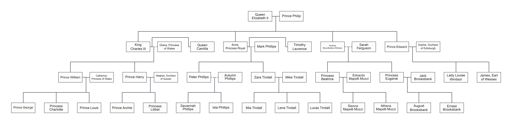

# Family Tree Generator

A Python script for generating family tree diagrams.

## Example



## Usage

With `python`:

```sh
python main.py examples/example.yaml
```

With `uv`:

```sh
uv run main.py examples/example.yaml
```

## Configuration

All family configuration is stored in a `.yaml` file.

### People

Each person can have a `name` and `secondaryName`. `secondaryName` can be used
for names in other languages, year of birth, or other information to display.
Other properties are ignored.

```yaml
ElizabethII:
  name: Queen Elizabeth II
```

### Relationships

Relationships specify parents and children. `current` optionally indicates
whether the relationship is current.

```yaml
- partners:
    - ElizabethII
    - Philip
  children:
    - CharlesIII
    - Anne
    - AndrewMountbattenWindsor
    - Edward
```

### Config

Config allows specifying an `origin` from which the family tree is built.
Use `skipExpansion` for nodes that should appear in the tree but should not be
expanded further. Use `skipVisit` for nodes that should be omitted from the tree
entirely.

```yaml
config:
  origin: ElizabethII
  skipExpansion:
    - AndrewMountbattenWindsor
  skipVisit: []
```

Update `FONT_CANDIDATES` in `constants.py` to specify the fonts to use for
rendering the family tree.
